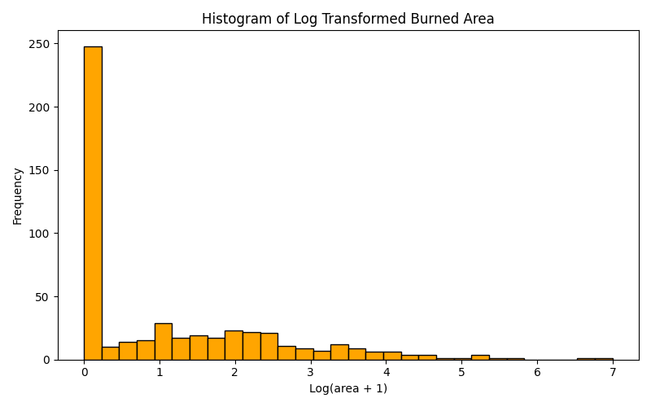
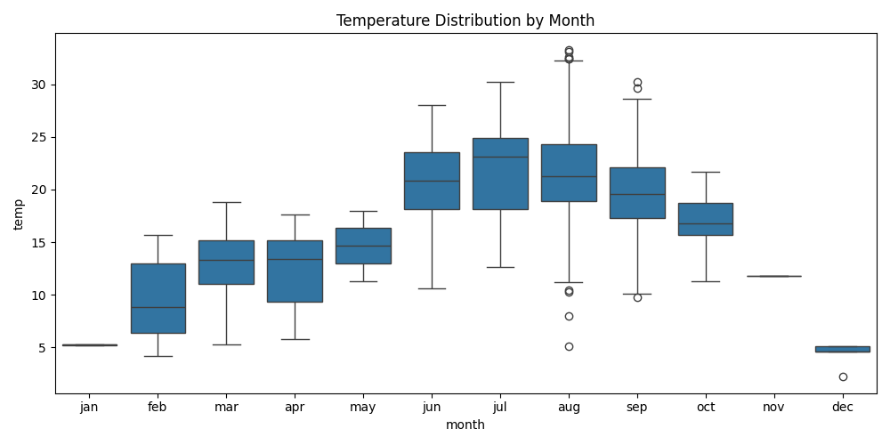
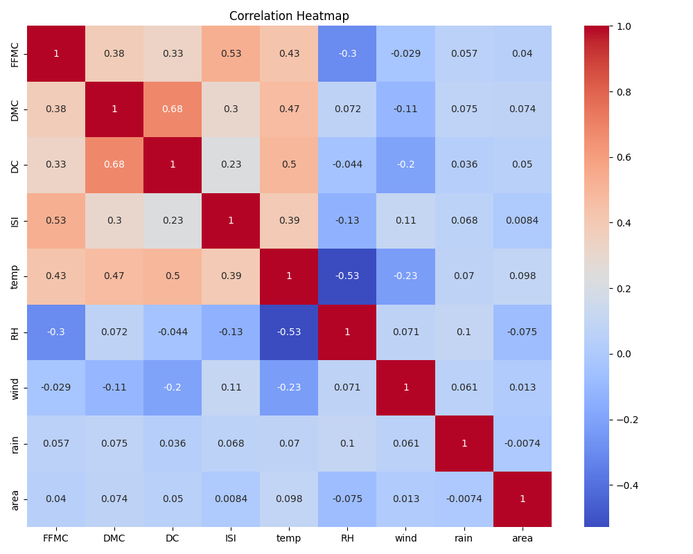
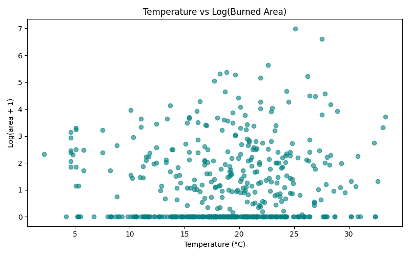

# 🔥 Forest Fire Data Analysis

This project focuses on analyzing a forest fire dataset to identify patterns, explore relationships between variables, and understand the impact of environmental factors on wildfire spread.

---

## 📥 1. Access the Data

The dataset used is `forestfires.csv`, originally from the **UCI Machine Learning Repository**.  
It contains meteorological data and forest fire records from the Montesinho region in Portugal.

- **Total records:** 517
- **Features include:**
  - Weather conditions (temp, RH, wind, rain)
  - Fire indexes (FFMC, DMC, DC, ISI)
  - Day, month, and area burned

---

## 🧹 2. Clean or Organize the Data

We performed the following cleaning steps:

- ✅ Converted `month` and `day` columns to lowercase for consistency
- ✅ Removed duplicate rows (if any)
- ✅ Checked for and confirmed absence of null values
- ✅ Added a `log_area` column using log(area + 1) to normalize highly skewed values
- ✅ Sorted the data based on key variables for easier analysis

The cleaned data was saved as: `cleaned_forestfires.csv`

---

## 📊 3. Exploratory Data Analysis (EDA)

We performed EDA to understand feature behavior and relationships:

- **Value counts** for `month` and `day` show most fires happen in **August and September**
- **Correlation matrix** shows that temperature, wind, and FFMC have relationships with the burned area
- **Distribution** of `area` is highly skewed, hence `log_area` was used for analysis

Key variables studied:
- Weather: `temp`, `RH`, `wind`, `rain`
- Fire behavior indexes: `FFMC`, `DMC`, `ISI`, etc.

---

## 📉 4. Virtual Representation (Visualizations)

Several visualizations were created using `matplotlib`, `pandas`, and `seaborn`:

### 🔸 Histogram
- Distribution of the log-transformed burned area

### 🔸 Boxplot
- Temperature trends across each month

### 🔸 Heatmap
- Correlation matrix to identify related variables

### 🔸 Scatter Plot
- Relationship between temperature and log(area)

---

## ✅ 5. Conclusion and Analysis Impact

### 🔍 Findings:
- 🔥 Most fires occur during **dry months**, especially **August and September**
- 🌡️ **High temperatures** and **low humidity** contribute to larger burned areas
- 🌬️ **Wind** has a mixed effect but can increase fire spread under specific conditions
- 🌧️ **Rainfall** is minimal during most fire events

### 🧠 Impact:
This analysis provides a data-driven understanding of how forest fires behave in relation to environmental factors. Such insights can assist **disaster management teams**, **forest departments**, and **climate researchers** in:

- Designing early warning systems
- Allocating fire prevention resources
- Predicting fire-prone periods using weather forecasts

---

## 🧠 Author

**Subhasish Moran**  
CSE, 6th Semester — Kaziranga University  
🔗 Passionate about Data, AI & Cloud
